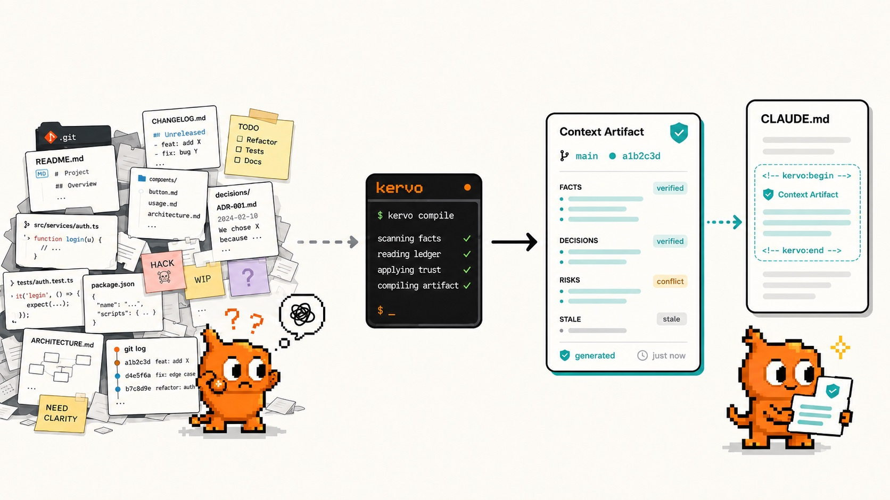
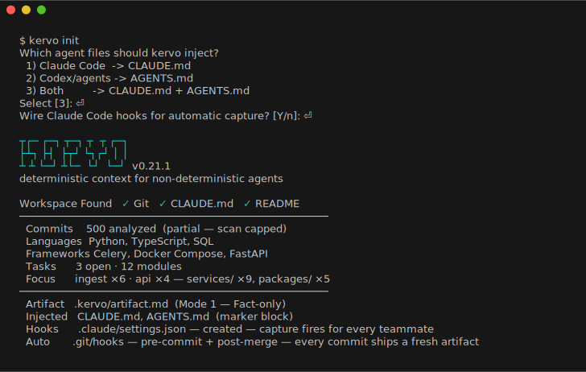
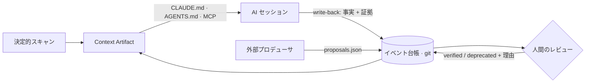
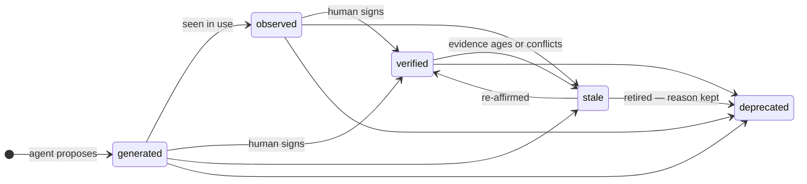
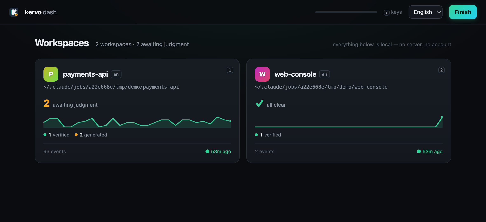
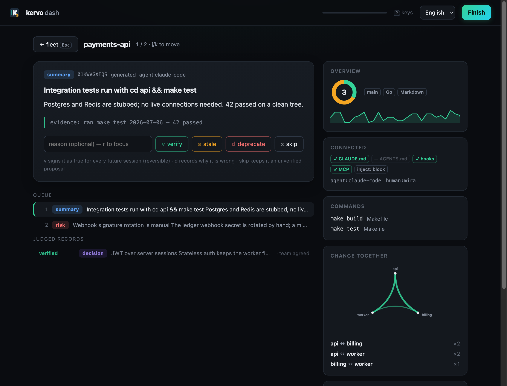
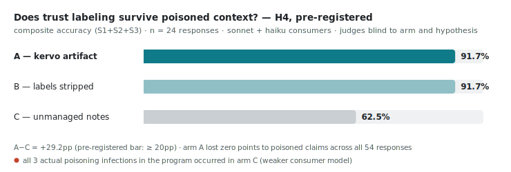

<div align="center">


### 非決定的エージェントのための決定的コンテキスト

**AI にプロジェクトを毎回説明し直すのはやめましょう。`kervo init` 一度だけ。**

[](https://github.com/kervo-os/kervo/actions/workflows/ci.yml)
[](https://github.com/kervo-os/kervo/releases)
[](go.mod)
[](https://goreportcard.com/report/github.com/kervo-os/kervo)
[](LICENSE)
[](https://doi.org/10.5281/zenodo.21241109)

[English](README.md) | [한국어](README.ko.md) | **日本語**

[インストール](#インストール) ·
[クイックスタート](#クイックスタート) ·
[機能](#機能) ·
[ダッシュボード](#ダッシュボード) ·
[チーム利用](#チームリポジトリでは) ·
[計測結果](#主張ではなく計測) ·
[コマンド](#コマンド) ·
[FAQ](FAQ.md) ·
[コントリビュート](#コントリビュート)

</div>

---

**エージェントへの「OK」がチームの署名された記憶になります。** どの
エージェントも、このワークスペースを開いた瞬間に、何が事実で、何が決定
され、何をまだ信じてはいけないかを知って始めます — そしてその記憶は
セッションごとに育ちます。

<p align="center"></p>

kervo はリポジトリを決定的な **Context Artifact** にコンパイルし、
`CLAUDE.md` / `AGENTS.md` に注入します — すべての AI セッションが、
プロジェクトを既に知っている状態から始まるように。事実(Fact)は決定的に
抽出され、解釈はトラストラベル付きの提案としてのみ入ります。提案は検証
され、古くなり、**除外理由を表示したまま**退役します。このリポジトリは
自分の作ったものを自分で使っています:ここの [`CLAUDE.md`](CLAUDE.md) は
kervo がコンパイルしたものです。

## インストール

```bash
brew install kervo-os/tap/kervo   # macOS & Linux
npm install -g @kervo-os/kervo    # Node 18+ があれば全プラットフォーム
# または: go install github.com/kervo-os/kervo/cmd/kervo@latest
```

macOS・Linux・Windows 向けのビルド済みバイナリは
[リリースページ](https://github.com/kervo-os/kervo/releases)にあります —
Go ツールチェーンは不要です。

## クイックスタート

対話式の `kervo init` は二つの質問をして、スキャンは 1 秒未満で終わります
(コミット上限 500、到達時は partial 表示):



Artifact が含むもの:リポジトリ要約 · 宣言されたコマンド(Makefile、npm
スクリプト、docker-compose、pyproject、justfile) · マージノイズを除いた
最近の変更 · 未解決の TODO/FIXME · モジュール構成(モノレポのモジュール別
ドキュメントを含む)— そして目標 / 決定 / リスク / 要約を運ぶトラスト
ラベル付きスロット。

触れるのは `<!-- kervo:begin -->` と `<!-- kervo:end -->` の間のブロック
だけです — 手で書いた内容はバイト単位で保存され、`init` の再実行は冪等
です。

## ループ



エージェントが発見して提案します。人間は一度だけ判定します。検証済みの
コンテキストは以後のすべてのセッションに — どのエージェントにも、どの
チームメイトにも — ツール呼び出しゼロで戻ります。厳密に分離された 2 層:

| 層 | 内容 | 生成方法 |
|---|---|---|
| **Fact スケルトン** | 要約、コマンド、変更、タスク、モジュール | 決定的スキャン — 同じワークスペースなら同じバイト、CI のゴールデンテストで固定。この経路に LLM は決して入らない。 |
| **トラストスロット** | 目標、決定、リスク、要約 | 出所付きのラベル提案 — 事実を装わず、匿名もなし。 |

## 機能

**トラストライフサイクル。** 蓄積されたコンテキストは腐ります — そして
間違ったコンテキストは無いより悪い。事実でないものはすべて、出所付きの
ラベル提案として入ります:

```text
**[generated — backend:openai/gpt-oss-120b]**
Needs confirmation — current focus appears to be terminal input/UX
hardening… Evidence: Recent Changes 05-28..06-28.
```




状態は `generated → observed → verified → stale → deprecated` へ動きます
— 減衰タイマーではなく、証拠と人間の確認によって。判断が割れたら黙って
勝者を選ぶ代わりに `⚠ conflict` と表示し、退役した項目は除外理由とともに
残ります。エージェントがキャプチャ・提案・管理し、**人間は判定だけ** —
エージェントは自分の主張に自分で署名できません。

**Brief。** すべての artifact は決定的なオリエンテーションで始まります —
最近のコミットが集中する場所、実行コマンド一行、未解決タスク、未プッシュ
数。意図の解釈はせず、数えるだけ。信号がなければ何も描画しません。

**write-back プロトコル。** artifact は AI コンシューマに、苦労して発見
した永続的な事実を、主張を先頭にしたマークダウンと**証拠**(実行した
コマンド、読んだドキュメント)でキャプチャするよう指示します — 検証の
労働はエージェントが担い、人間の署名はキー一つ。重複は自動で落ち、判定
待ち 12 件が溜まったソースはバックプレッシャーにかかります。

**会話がレビューです。** セッション中に人間が事実を肯定したら、
エージェントはその言葉を引用して判定を一緒に中継します。キューに残るのは
誰も見ていないものだけ。verified 項目と矛盾する証拠は、黙った再提案では
なく質問として戻ってきます。

**どこでも判定。** チャットでは MCP、ターミナルでは `kervo review`、
そして全リポジトリを一度に — [ダッシュボード](#ダッシュボード)で。

**決定が CI をゲートします。** 決定にアンカーを付けると —
`kervo capture -type decision -body "Payments は Q3 まで legacy gateway
を維持" -anchor "services/payments/**"` — verified な決定が治める
パスに触れる PR ごとに `kervo check` が diff にインラインで警告します
(GitHub annotations、ボットコード 0 行)。デフォルトは advisory:
衝突する PR は意図された翻意かもしれないので、警告文がループを教えます
— 理由付きで deprecate し、新しい決定を capture。アンカーのパスが
ツリーから消えると stale 候補として表示されます — 年齢タイマーではなく
証拠ベースの無効化です。

```yaml
- run: git fetch origin main
- run: kervo check -base origin/main   # ブロックするなら -strict
```

<details>
<summary><b>コンシューマ — Claude Code、Codex、MCP を話すすべて</b></summary>
<br>

`kervo init -consumers claude|codex|both|auto` が注入先を選び、選択は
ワークスペースごとに保持されます(`.kervo/consumers`、コミット対象)。
既存の `AGENTS.md` は常に尊重されます — ファイルの存在がオプトインで、
kervo がこのファイルを勝手に作ることはありません。

`CLAUDE.md` をきれいに保ちたいなら `kervo compile -inject import` が
フルブロックの代わりに `@.kervo/artifact.md` の一行だけを注入します。
トレードオフは意図的です:artifact ファイルは派生物で gitignore 対象の
ため、新しいクローンは `kervo compile` 一回までは何も見えません — フル
ブロックがデフォルトである理由です。(`@` 行は Claude Code の構文で、
AGENTS.md のリーダーは展開しないかもしれません。)

MCP サーバーを登録すれば会話がレビュー面になります —
*「レビューキューを見せて」* → *「#2 を verify、証拠は確認した」*:

```json
{ "mcpServers": { "kervo": { "command": "kervo", "args": ["mcp"] } } }
```

ツールは 4 つ:`read_context`(事実の出力)、`kervo_capture`
(write-back)、`review_queue` / `review_judge`(人間が述べた判定の中継 —
エージェント自身の判断は禁止)。
</details>

<details>
<summary><b>フック — 自動キャプチャ、ウィザードが配線</b></summary>
<br>

init ウィザードがこのファイルを書いてくれます(スクリプトでは
`-hooks yes`)。手動ならプロジェクトの `.claude/settings.json` に追加:

```json
{
  "hooks": {
    "UserPromptSubmit": [
      { "hooks": [{ "type": "command", "command": "kervo hook || true", "timeout": 10 }] }
    ],
    "SessionStart": [
      { "hooks": [{ "type": "command", "command": "kervo hook || true", "timeout": 10 }] }
    ],
    "PostToolUse": [
      { "matcher": "Edit|Write",
        "hooks": [{ "type": "command", "command": "kervo hook || true", "timeout": 10 }] }
    ]
  }
}
```

フックはミリ秒予算のローカル append です — LLM なし、ネットワークなし、
セッションを決して壊さない(ゴミが来ても exit 0)。コミットされる台帳に
入るのは**名前・ワークスペース相対パス・サイズだけ**:プロンプトや
ファイルの内容はマシンを離れず、git 履歴にも入りません。

鮮度はオプトインではありません:すべての `init`/`compile` が
`pre-commit` フック(コミット直前に再コンパイルし、**コミット自身が最新
の artifact を運ぶ** — ツリーはクリーンなまま)と `post-merge` フック
(pull で入ってくるコミットも更新)を配線します。git フックはマシン
ローカルなので、チームメイトは最初の `kervo compile` 一回で自分のマシン
が配線されます。自分で書いたフックは決して書き換えません(我々のフック
を自分のものに置き換えることがオプトアウトです)。
</details>

<details>
<summary><b>外部プロデューサ — 何でも台帳に供給できます</b></summary>
<br>

グラフビルダー、メモリストア、wiki ジェネレータ:`.kervo/proposals.json`
にエントリを置けば、`compile` が出所付きの `generated` として取り込みます —

```json
[{ "slot": "summaries", "body": "AuthService は TokenStore に依存", "source": "graphify" }]
```

この形式に state フィールドが無いのは設計です:プロデューサは自己昇格
できません。キューを人間が扱える規模に保つ規範が二つ — **コーパスでは
なく結論を**(ファイルにあるものはファイルに置き、証拠として引用)そして
**バックプレッシャー**。他のツールは記憶を生成し、kervo はどの記憶を
次のセッションへ運んで安全かを判定します。
</details>

<details>
<summary><b>セマンティックスロット — 三つのモード、優雅な縮退</b></summary>
<br>

| モード | 目標/決定/リスク/要約を埋めるもの | 必要なもの |
|---|---|---|
| **1 — Fact 専用**(デフォルト) | なし — 決定的な事実のみ。常に動作。 | git |
| **2 — コンシューマ支援** | AI セッションが提案を積む | エージェントセッション |
| **3 — 専用バックエンド** | OpenAI 互換エンドポイントが提案 | ローカル/リモート LLM |

バックエンドが失敗しても警告とともに降格するだけで、Fact スケルトンは
常に生成されます。Mode 3 は、キャプチャするエージェントがまだ働いた
ことのないリポジトリのためのブートストラップチャネルです — Mode 2 の
キャプチャが生きているなら env は未設定のままに(実リポジトリでの計測:
artifact だけを読む推論は意図ではなく履歴を読みます)。完全ローカルで、
何もマシンの外に出ません:

```bash
export KERVO_SEMANTIC_URL=http://localhost:1234/v1   # LM Studio (または Ollama :11434/v1)
export KERVO_SEMANTIC_MODEL=openai/gpt-oss-120b
kervo compile
```

Artifact はデフォルトで英語で描画され、`-lang ko` / `-lang ja` で
ワークスペースごとにローカライズされます。アーカイブ資料は
`.kervoignore`(1 行に 1 パス接頭辞)で TODO スキャンから除外できます。
</details>

## ダッシュボード

`kervo compile` を実行するたびに、ワークスペースの**パス**(パスのみ、
マシンローカル、コミットされない)が `~/.kervo/workspaces.json` に登録
されます。`kervo dash` はその全部をワンショットの 127.0.0.1 ダッシュ
ボード一ページに広げます — リポジトリごとの判定待ち・28 日のアクティビ
ティ・トラスト構成・プロジェクト概要・コミット履歴が証明する結合度・
実際に接続されたアダプタ — キーボードファーストの判定(`1`–`9` で
リポジトリを開き、`j`/`k` で移動、`v`/`s`/`d` で判定、`?` でキー一覧)
付きで、各判定はそのリポジトリ自身の台帳に書き込まれます。

<p align="center"></p>

キューの下のナレッジビューは verified・observed の全文を — 主張を先頭に、
証拠付きで — 描画し、退役した項目は理由とともに残ります。UI はあなたの
言語を話します(`$LANG`、`-lang`、またはページ内スイッチャー)。真実は
リポジトリごとに git に残り、ダッシュボードはストアではなくレンズで、
コマンドとともに消えます。

<p align="center"></p>

## チームリポジトリでは

コミットされる真実と派生状態の分離が、コンテキストを移動可能にします:

| 状態 | パス | git にコミット? |
|---|---|---|
| イベント台帳 — 真実 | `.kervo/events/*.jsonl` | **はい** — append-only、`merge=union`:ブランチマージは台帳の和集合 |
| 言語 · inject モード · コンシューマ | `.kervo/lang` … | **はい** — チームの選択 |
| 注入されたコンテキストブロック | `CLAUDE.md` / `AGENTS.md` | **はい** |
| コンパイル済み artifact・キャッシュ | `.kervo/artifact.md` … | いいえ — 派生物、`compile` が再生成 |

1. **最初の導入** — 一人が `kervo init` を一度実行し、結果をコミット
   します。
2. **チームメイトがクローン** — コンテキストは既に生きています:AI
   セッションは**コマンドゼロ**で読み、`kervo status` / `dash` も
   クローンされた台帳で即座に動きます。
3. **ライブ移行** — `brew install kervo-os/tap/kervo` の後
   `kervo compile` で再スキャン(`init` も冪等なので、癖で実行しても
   何も壊れません)。
4. **フック** — コミットされた `.claude/settings.json` が、`kervo` が
   PATH にあるチームメイト全員のキャプチャを自動で発火させます。

このリポジトリの新しいクローンで検証済み:`compile` がコミット済み台帳を
再生し、トラスト状態と言語はそのまま保たれました。

## 主張ではなく計測

これは本当に、汚染されたコンテキストからエージェントを守るのか?仮説を
事前登録してブラインド実験を行いました:同じリポジトリ、三つの
コンテキスト腕 — **A**(kervo artifact)、**B**(同じ内容、トラスト
ラベル除去)、**C**(管理なしのノート)— 偽の「決定」を仕込み、新しい
コンシューマセッション、腕も仮説も知らない審判。

確証ラン(事前登録、リポジトリアクセスなし、sonnet + haiku コンシューマ、
n = 24):

<picture>
  <source media="(prefers-color-scheme: dark)" srcset="assets/h4-chart-dark.svg">
  
</picture>

| | **A — kervo** | B — ラベル除去 | C — 管理なし |
|---|---|---|---|
| 総合 S1+S2+S3 | **91.7%** | 91.7% | 62.5% |

- **A−C = +29.2pp** — 事前登録の基準(≥20pp)を満たしました(95% CI
  6.9–51.5pp — 統計的証明ではなく、複製キットを公開した強い事前登録
  シグナルです)。プログラム全体で起きた実際の汚染感染(3 件)は、すべて
  弱いコンシューマモデルの C 腕で発生しました。
- プログラム全体の 54 応答で、A 腕は汚染された主張に 1 点も失いません
  でした。上の表で B が A と同率なのは、総合効果の本体がラベル単独では
  なく**取り扱いポリシー** — 古いものは分離、退役は除外 — にあること
  を意味します。
- ラベルの持ち分は伝染が襲う場面で現れます:先行する混合条件のランでは、
  一つの嘘が見つかるとラベルなしの腕は*真実の*事実まで連座で拒否しました。
  コードが反証できる嘘はエージェントが自力で防ぎます — ラベルはコードの
  外に生きる真実(決定、制約、文脈)が巻き添えになるのを防ぎ、コンシューマ
  が弱いほど保護は大きくなります。

そして実際の本番モノレポで(そのリポジトリ自身の台帳から):

| 計測したもの | 結果 |
|---|---|
| write-back パイロット:capture → 台帳 → compile → 新規コンシューマ | オンボーディング回答 **5.5/10 → 9.5/10**、コスト不変(ツール呼び出し 1 回) |
| トラストラベルのコンシューマ到達 | 消費エージェントが促されずに自分の回答へ `[generated]` を明示 |
| Mode 3 バックエンド提案、正解データとの照合 | goal C+ / risk D → ブートストラップチャネルとして再配置 |

完全なプロトコル・事前登録・生の応答:
[kervo-os/experiments](https://github.com/kervo-os/experiments)。採点は
構造的にブラインドされた審判によるエージェント採点(事前登録ルーブリック)
で、人間採点のレプリケーションキットは同梱していますが未実行です —
限界は隠さず明記します。

## コマンド

| コマンド | 機能 |
|---|---|
| `kervo init` | 初回ウィザード:スキャン → artifact → 注入(冪等) |
| `kervo compile [-lang en\|ko\|ja] [-inject block\|import]` | 増分再スキャン + 再コンパイル;Mode 3 → 2 → 1 フォールバック |
| `kervo capture -type <t> -body <md> -evidence <e> [-anchor <glob>…]` | 観察を記録(重複排除 + バックプレッシャー);アンカーはこの観察が治めるパス |
| `kervo trust -id <接頭辞> -to verified\|stale\|deprecated -reason <理由>` | ID で判定(スクリプト用プリミティブ) |
| `kervo review` | ターミナルのトリアージキュー — 一件ずつ判定 |
| `kervo check [-base <ref>] [-strict]` | diff のゲート:この変更が触れる verified なアンカー付き決定は? |
| `kervo dash` | フリートダッシュボード — 登録された全ワークスペースを一ページに、インライン判定 |
| `kervo status` | 一画面の台帳 + トラストビュー |
| `kervo metrics` | artifact あり/なしのプロンプトサイズ(内蔵 A/B カウンター) |
| `kervo import claude` | Claude Code トランスクリプトから台帳をバックフィル(サイズのみ) |
| `kervo hook` | コンシューマフックのエントリポイント(stdin JSON、ミリ秒予算) |
| `kervo mcp` | stdio MCP サーバー — コンテキスト出力、write-back 受信、チャット判定 |
| `kervo version` | バージョン表示 |

## 設計保証

- **決定的スケルトン** — 同じワークスペース、同じ言語なら同じバイト;
  CI のゴールデンファイルで固定。Fact の経路に LLM は決して入らない。
- **イベントが真実** — append-only の JSONL 台帳が git にコミットされる
  (`merge=union`);残りはすべて派生物で再構築可能。リポジトリを
  クローンすれば記憶も一緒に移動。
- **境界は検査で** — 純粋なコアはアダプタを import できない
  (`make arch-check`);データ由来のテキストは構造マーカーを偽装
  できない;プロバイダは `generated` より上へ自己昇格できない;
  エージェントは自分の主張に署名できない。
- **サーバーなし、デーモンなし、DB なし、アカウントなし** — すべての
  状態は `.kervo/` とコンシューマファイルに。依存関係ゼロ:`go.mod` は
  stdlib のみ。

## ステータスとロードマップ

v0.19.x、実際の本番リポジトリで稼働中 — リリースは CI を通過し、理由が
あるときだけ切られ、すべて [CHANGELOG.md](CHANGELOG.md) にあります。
証拠は [kervo-os/experiments](https://github.com/kervo-os/experiments) に。
次のゲート: 事前登録フライホイール再実行 — セッション 10 + 判定済み
write-back 10、カレンダーではなくボリューム基準。

## コントリビュート

```bash
make build   # go 1.23+; ビルド手順はこれだけ
go test -race ./...
make arch-check   # core は adapters を import できない
```

Issue と PR を歓迎します。レビュアーが守らせる二つのこと: **依存関係ゼロ**
(`go.mod` は stdlib のみ — 新しい依存には例外的な理由が必要)と**決定論**
(スケルトンはゴールデンファイルで、i18n テーブルは完全性テストで固定、
CI はレースディテクタ付き)。設計判断はこのリポジトリ自身の台帳にあります —
クローンで `kervo dash` を開き、ナレッジビューを読んでください。

---

kervo はコーディングツールではありません。git の上で生きるすべての
チームのための記憶レイヤーです — 開発者はすでに作業をコミットとして
保存しているから、最初の市場であるにすぎません。

ライセンス: [Apache-2.0](LICENSE)。
