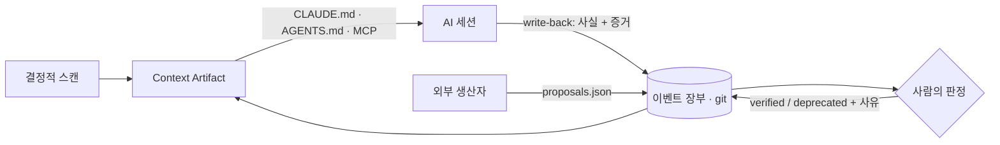

<div align="center">


### 비결정적 에이전트를 위한 결정적 컨텍스트

**AI에게 프로젝트를 매번 다시 설명하지 마세요. `kervo init` 한 번이면 됩니다.**

[](https://github.com/kervo-os/kervo/actions/workflows/ci.yml)
[](https://github.com/kervo-os/kervo/releases)
[](go.mod)
[](https://goreportcard.com/report/github.com/kervo-os/kervo)
[](LICENSE)

[English](README.md) | **한국어** | [日本語](README.ja.md)

[설치](#설치) ·
[빠른 시작](#빠른-시작) ·
[기능](#기능) ·
[대시보드](#대시보드) ·
[팀 사용](#팀-레포에서) ·
[측정 결과](#주장이-아니라-측정) ·
[명령어](#명령어) ·
[기여](#기여하기)

</div>

---

**에이전트에게 준 "ㅇㅋ"가 팀의 서명된 기억이 됩니다.** 어떤 에이전트든
이 워크스페이스를 여는 순간, 무엇이 사실이고 무엇이 결정됐고 무엇을 아직
믿으면 안 되는지 알고 시작합니다 — 그리고 그 기억은 세션마다 자랍니다.

<p align="center"></p>

kervo는 저장소를 결정적 **Context Artifact**로 컴파일해
`CLAUDE.md` / `AGENTS.md`에 주입합니다 — 모든 AI 세션이 프로젝트를 이미
아는 상태에서 시작하도록. 사실(Fact)은 결정적으로 추출되고, 해석은 오직
신뢰 라벨이 달린 제안으로만 들어옵니다. 제안은 검증되고, 낡아지고,
**제외 사유가 표시된 채** 퇴역합니다. 이 저장소는 자기가 만든 것을 자기가
씁니다: 여기의 [`CLAUDE.md`](CLAUDE.md)는 kervo가 컴파일한 것입니다.

## 설치

```bash
brew install kervo-os/tap/kervo   # macOS & Linux
# 또는: go install github.com/kervo-os/kervo/cmd/kervo@latest
```

macOS·Linux·Windows용 프리빌트 바이너리는
[릴리스 페이지](https://github.com/kervo-os/kervo/releases)에 있습니다 —
Go 툴체인이 필요 없습니다.

## 빠른 시작

대화형 `kervo init`은 질문 세 개를 묻고, 스캔은 1초 미만입니다(커밋 상한
500개, 도달 시 partial 표시):

```text
$ kervo init
Which agent files should kervo inject?
  1) Claude Code  -> CLAUDE.md
  2) Codex/agents -> AGENTS.md
  3) Both         -> CLAUDE.md + AGENTS.md
Select [3]: ⏎
Wire Claude Code hooks for automatic capture? [Y/n]: ⏎
Refresh the artifact automatically on commit and pull? [Y/n]: ⏎

Workspace Found   ✓ Git   ✓ CLAUDE.md   ✓ README
──────────────────────────────────────────────────
  Commits    500 analyzed  (partial — scan capped)
  Languages  Python, TypeScript, SQL
  Frameworks Celery, Docker Compose, FastAPI
  Tasks      3 open · 12 modules
  Focus      ingest ×6 · api ×4 — services/ ×9, packages/ ×5
──────────────────────────────────────────────────
  Artifact   .kervo/artifact.md  (Mode 1 — Fact-only)
  Injected   CLAUDE.md, AGENTS.md  (marker block)
  Hooks      .claude/settings.json — created — commit it and capture fires for every teammate
  Auto       .git/hooks — post-commit + post-merge — commits and pulls now refresh the artifact
```

Artifact가 담는 것: 저장소 요약 · 선언된 명령어(Makefile, npm 스크립트,
docker-compose, pyproject, justfile) · 머지 노이즈를 제외한 최근 변경 ·
열린 TODO/FIXME · 모듈 구조(모노레포의 모듈별 문서 포함) — 그리고
목표 / 결정 / 리스크 / 요약을 담는 트러스트 라벨 슬롯.

`<!-- kervo:begin -->`과 `<!-- kervo:end -->` 사이 블록만 건드립니다 —
손으로 쓴 내용은 바이트 단위로 보존되고, `init` 재실행은 멱등입니다.

## 루프



에이전트가 발견하고 제안합니다. 사람은 한 번만 판정합니다. 검증된
컨텍스트는 이후 모든 세션에 — 어떤 에이전트든, 어떤 팀원이든 — 도구 호출
0회로 돌아갑니다. 엄격히 분리된 2계층:

| 계층 | 내용 | 생산 방식 |
|---|---|---|
| **Fact 스켈레톤** | 요약, 명령어, 변경, 태스크, 모듈 | 결정적 스캔 — 같은 워크스페이스면 같은 바이트, CI 골든 테스트로 고정. 이 경로에 LLM은 절대 없음. |
| **트러스트 슬롯** | 목표, 결정, 리스크, 요약 | 출처가 달린 라벨 제안 — 사실로 위장하지 않고, 익명도 없음. |

## 기능

**트러스트 수명주기.** 축적된 컨텍스트는 부패합니다 — 그리고 틀린
컨텍스트는 없는 것보다 나쁩니다. 사실이 아닌 모든 것은 출처가 달린 라벨
제안으로 들어옵니다:

```text
**[generated — backend:openai/gpt-oss-120b]**
Needs confirmation — current focus appears to be terminal input/UX
hardening… Evidence: Recent Changes 05-28..06-28.
```

상태는 `generated → observed → verified → stale → deprecated`로
움직입니다 — 감쇠 타이머가 아니라 증거와 사람의 확인으로. 판단이 갈리면
조용히 승자를 고르는 대신 `⚠ conflict`로 표시하고, 퇴역 항목은 제외
사유와 함께 남습니다. 에이전트가 캡처·제안·관리하고 **사람은 판정만**
합니다 — 에이전트는 자기 주장에 스스로 서명할 수 없습니다.

**Brief.** 모든 artifact는 결정적 오리엔테이션으로 시작합니다 — 최근
커밋이 몰리는 곳, 실행 한 줄, 열린 태스크, 미푸시 개수. 의도 해석 없이
세는 것만; 신호가 없으면 아무것도 렌더하지 않습니다.

**write-back 프로토콜.** artifact는 AI 소비자에게, 어렵게 알아낸 지속적
사실을 주장-우선 마크다운과 **증거**(실행한 명령, 읽은 문서)로 캡처하라고
지시합니다 — 검증 노동은 에이전트가 지고, 사람의 서명은 키 한 번이면
됩니다. 중복은 자동으로 버려지고, 판정 대기 12건이 쌓인 소스는 사람이
따라잡을 때까지 역압에 걸립니다.

**대화가 곧 검토.** 사람이 세션에서 사실에 동의하면 에이전트가 그 발언을
인용해 판정을 함께 중계합니다. 큐에는 아무 사람도 못 본 것만 남고,
verified 항목과 모순되는 증거는 조용한 재제안이 아니라 질문으로
돌아옵니다.

**어디서든 판정.** 채팅에서 MCP로, 터미널에서 `kervo review`로, 또는
모든 레포를 한 번에 — [대시보드](#대시보드)에서.

<details>
<summary><b>소비자 — Claude Code, Codex, 그리고 MCP를 쓰는 모든 것</b></summary>
<br>

`kervo init -consumers claude|codex|both|auto`가 주입 대상을 정하고,
선택은 워크스페이스별로 유지됩니다(`.kervo/consumers`, 커밋됨). 이미 있는
`AGENTS.md`는 항상 존중합니다 — 파일 존재가 곧 opt-in이고, kervo가 이
파일을 스스로 만들지는 않습니다.

`CLAUDE.md`를 깔끔하게 유지하고 싶다면? `kervo compile -inject import`가
전체 블록 대신 `@.kervo/artifact.md` 한 줄만 주입합니다. 트레이드오프는
의도된 것입니다: artifact 파일은 파생물이라 gitignore 대상이므로, 신선한
클론은 `kervo compile` 한 번 전까지 아무것도 보지 못합니다 — 전체 블록이
기본값인 이유입니다. (`@` 줄은 Claude Code 문법이라 AGENTS.md 소비자는
확장하지 못할 수 있습니다.)

MCP 서버를 등록하면 대화가 곧 검토 표면이 됩니다 — *"검토 큐 보여줘"* →
*"2번 verify, 증거 확인했어"*:

```json
{ "mcpServers": { "kervo": { "command": "kervo", "args": ["mcp"] } } }
```

도구 4개: `read_context`(사실 내보내기), `kervo_capture`(write-back),
`review_queue` / `review_judge`(사람이 말한 판정의 중계 — 에이전트 자신의
판단은 금지).
</details>

<details>
<summary><b>훅 — 자동 캡처, 위저드가 배선</b></summary>
<br>

init 위저드가 이 파일을 대신 써줍니다(스크립트에선 `-hooks yes`); 직접
하려면 프로젝트의 `.claude/settings.json`에 추가하세요:

```json
{
  "hooks": {
    "UserPromptSubmit": [
      { "hooks": [{ "type": "command", "command": "kervo hook || true", "timeout": 10 }] }
    ],
    "SessionStart": [
      { "hooks": [{ "type": "command", "command": "kervo hook || true", "timeout": 10 }] }
    ],
    "PostToolUse": [
      { "matcher": "Edit|Write",
        "hooks": [{ "type": "command", "command": "kervo hook || true", "timeout": 10 }] }
    ]
  }
}
```

훅은 밀리초 예산의 로컬 append입니다 — LLM 없음, 네트워크 없음, 세션을
절대 깨지 않음(쓰레기가 들어와도 exit 0). 커밋되는 장부에는 **이름·
워크스페이스 상대 경로·크기만** 저장됩니다: 프롬프트와 파일 내용은 머신을
떠나지도, git 히스토리에 들어가지도 않습니다.

위저드는 git 자동 컴파일도 제안합니다(스크립트에선 `-autocompile yes`):
`post-commit`·`post-merge` 훅이 `kervo compile`을 다시 돌려서, 로컬 커밋은
물론 **pull로 들어오는 커밋**에도 artifact가 갱신됩니다. git 훅은 머신
로컬이라 — 팀원은 `kervo init` 한 번(멱등)이면 자기 것이 배선됩니다.
</details>

<details>
<summary><b>외부 생산자 — 무엇이든 장부에 공급할 수 있습니다</b></summary>
<br>

그래프 빌더, 메모리 스토어, 위키 생성기: `.kervo/proposals.json`에 항목을
적재하면 `compile`이 출처를 달아 `generated`로 수용합니다 —

```json
[{ "slot": "summaries", "body": "AuthService는 TokenStore에 의존", "source": "graphify" }]
```

이 형식에 state 필드가 없는 건 설계입니다: 생산자는 자가 승격할 수
없습니다. 큐를 사람이 감당하게 하는 규범 둘 — **코퍼스가 아니라 결론만**
(파일에 있는 건 파일에 두고 증거로 인용) 그리고 **역압**. 다른 도구는
기억을 만들고, kervo는 어떤 기억을 다음 세션에 가져갈지 판정합니다.
</details>

<details>
<summary><b>시맨틱 슬롯 — 세 가지 모드, 우아한 강등</b></summary>
<br>

| 모드 | 목표/결정/리스크/요약을 채우는 것 | 필요한 것 |
|---|---|---|
| **1 — Fact 전용** (기본) | 없음 — 결정적 사실만. 항상 동작. | git |
| **2 — 소비자 보조** | AI 세션이 제안을 적재 | 에이전트 세션 |
| **3 — 전용 백엔드** | OpenAI 호환 엔드포인트가 제안 | 로컬/원격 LLM |

백엔드가 실패해도 경고와 함께 내려갈 뿐, Fact 스켈레톤은 항상
생산됩니다. Mode 3는 캡처하는 에이전트가 아직 일한 적 없는 레포를 위한
부트스트랩 채널입니다 — Mode 2 캡처가 살아 있으면 env를 설정하지 마세요
(실레포 실측: artifact만 읽는 추론은 의도가 아니라 이력을 읽습니다).
완전 로컬, 아무것도 머신 밖으로 나가지 않습니다:

```bash
export KERVO_SEMANTIC_URL=http://localhost:1234/v1   # LM Studio (또는 Ollama :11434/v1)
export KERVO_SEMANTIC_MODEL=openai/gpt-oss-120b
kervo compile
```

Artifact는 기본 영어로 렌더링되며 `-lang ko` / `-lang ja`로 워크스페이스별
현지화됩니다. 보관 자료는 `.kervoignore`(한 줄에 경로 접두 하나)로 TODO
스캔에서 제외할 수 있습니다.
</details>

## 대시보드

`kervo compile`이 실행될 때마다 워크스페이스 **경로**(경로만, 머신 로컬,
커밋 안 됨)가 `~/.kervo/workspaces.json`에 등록됩니다. `kervo dash`는 그
전부를 일회성 127.0.0.1 대시보드 한 페이지에 펼칩니다 — 레포별 대기
판정·28일 활동·트러스트 구성·프로젝트 개요·커밋 이력으로 증명된
결합도·실제 연결된 어댑터 — 키보드 퍼스트 판정(`1`–`9` 레포 열기,
`j`/`k` 이동, `v`/`s`/`d` 판정, `?` 키 안내) 포함이며, 각 판정은 해당
레포 자신의 장부에 기록됩니다.

<p align="center"></p>

큐 아래 지식 뷰는 verified·observed 항목 전문을 — 주장 먼저, 증거 첨부 —
렌더하고, 퇴역 항목은 사유와 함께 남습니다. UI는 사용자의 언어를 따릅니다
(`$LANG`, `-lang`, 또는 화면의 언어 스위처). 진실은 레포별로 git에 남고,
대시보드는 저장소가 아니라 렌즈이며, 명령과 함께 사라집니다.

<p align="center"></p>

## 팀 레포에서

커밋되는 진실과 파생 상태의 분리가 컨텍스트를 이동 가능하게 만듭니다:

| 상태 | 경로 | git 커밋? |
|---|---|---|
| 이벤트 장부 — 진실 | `.kervo/events/*.jsonl` | **예** — append-only, `merge=union`: 브랜치 머지는 장부의 합집합 |
| 언어 · inject 모드 · 소비자 | `.kervo/lang` … | **예** — 팀의 선택 |
| 주입된 컨텍스트 블록 | `CLAUDE.md` / `AGENTS.md` | **예** |
| 컴파일된 artifact·캐시 | `.kervo/artifact.md` … | 아니오 — 파생물, `compile`이 재생성 |

1. **최초 도입** — 한 사람이 `kervo init`을 한 번 실행하고 결과를
   커밋합니다.
2. **팀원이 클론** — 컨텍스트는 이미 살아 있습니다: AI 세션은 **명령
   0개**로 바로 읽고, `kervo status` / `dash`도 클론된 장부에서 즉시
   동작합니다.
3. **라이브 전환** — `brew install kervo-os/tap/kervo` 후 `kervo compile`로
   재스캔(`init`도 멱등이라 습관적으로 실행해도 깨지지 않습니다).
4. **훅** — 커밋된 `.claude/settings.json`이 `kervo`가 PATH에 있는 팀원
   전원에게 캡처를 자동 발화시킵니다.

이 저장소의 신선한 클론으로 검증: `compile`이 커밋된 장부를 재생했고,
트러스트 상태와 언어가 그대로 유지됐습니다.

## 주장이 아니라 측정

이게 실제로 오염된 컨텍스트에서 에이전트를 보호하나? 가설을 사전 등록하고
블라인드 실험을 돌렸습니다: 같은 저장소, 세 가지 컨텍스트 암 — **A**(kervo
artifact), **B**(같은 내용, 트러스트 라벨 제거), **C**(관리 없는 노트) —
거짓 "결정"을 심고, 신선한 소비자 세션, 암과 가설을 모르는 심판.

확증 런 (사전 등록, 레포 접근 차단, sonnet + haiku 소비자, n = 24):

| | **A — kervo** | B — 라벨 제거 | C — 무관리 |
|---|---|---|---|
| 종합 S1+S2+S3 | **91.7%** | 91.7% | 62.5% |

- **A−C = +29.2%p** — 사전 등록 기준(≥20%p) 충족. 프로그램 전체에서
  발생한 실제 오염 감염(3건)은 전부 약한 소비자 모델의 C 암에서
  나왔습니다.
- 프로그램 전체 54개 응답에서 A 암은 오염된 주장에 단 1점도 잃지
  않았습니다. 무라벨 암의 실패는 *전염*이었습니다: 거짓 하나가 발견되면
  참인 사실까지 연좌제로 배척.
- 코드가 반증할 수 있는 거짓은 에이전트가 스스로 막습니다. **라벨이
  지키는 것은 코드 밖의 진실입니다** — 결정, 제약, 맥락. 소비자가
  약할수록 보호 효과는 커집니다.

그리고 실제 운영 모노레포에서 (그 레포 자신의 장부 기준):

| 측정한 것 | 결과 |
|---|---|
| write-back 파일럿: capture → 장부 → compile → 신규 소비자 | 온보딩 답변 **5.5/10 → 9.5/10**, 비용 불변(1 도구 호출) |
| 신뢰 라벨의 소비자 도달 | 소비 에이전트가 시키지 않아도 자기 답을 `[generated]`로 명시 |
| Mode 3 백엔드 제안, 그라운드트루스 대비 채점 | goal C+ / risk D → 부트스트랩 채널로 재배치 |

전체 프로토콜·사전 등록·원문 응답:
[kervo-os/experiments](https://github.com/kervo-os/experiments). 채점은
구조적으로 블라인드된 심판의 에이전트 채점(사전 등록 루브릭)이며, 사람
채점 복제 킷은 포함되어 있으나 실행하지 않았습니다 — 한계는 숨기지 않고
명시합니다.

## 명령어

| 명령 | 기능 |
|---|---|
| `kervo init` | 최초 1회 위저드: 스캔 → artifact → 주입 (멱등) |
| `kervo compile [-lang en\|ko\|ja] [-inject block\|import]` | 증분 재스캔 + 재컴파일; Mode 3 → 2 → 1 폴백 |
| `kervo capture -type <t> -body <md> -evidence <e>` | 관찰 기록 (중복 제거 + 역압 가드) |
| `kervo trust -id <접두> -to verified\|stale\|deprecated -reason <사유>` | ID로 판정 (스크립트용 프리미티브) |
| `kervo review` | 터미널 검토 큐 — 하나씩 판정 |
| `kervo dash` | 전체 대시보드 — 등록된 모든 워크스페이스를 한 페이지에, 인라인 판정 |
| `kervo status` | 한 화면 장부 + 트러스트 뷰 |
| `kervo metrics` | artifact 유/무 프롬프트 크기 (내장 A/B 카운터) |
| `kervo import claude` | Claude Code 트랜스크립트에서 장부 백필 (크기만) |
| `kervo hook` | 소비자 훅 진입점 (stdin JSON, 밀리초 예산) |
| `kervo mcp` | stdio MCP 서버 — 컨텍스트 출력, write-back 수신, 채팅 판정 |
| `kervo version` | 버전 출력 |

## 설계 보증

- **결정적 스켈레톤** — 같은 워크스페이스, 같은 언어면 같은 바이트; CI의
  골든 파일로 고정. Fact 경로에 LLM은 절대 없음.
- **이벤트가 진실** — append-only JSONL 장부가 git에 커밋됨
  (`merge=union`); 나머지는 전부 파생물이며 재구축 가능. 레포를 클론하면
  기억이 함께 이동.
- **경계는 검사로** — 순수 코어는 어댑터를 import할 수 없음
  (`make arch-check`); 데이터에서 온 텍스트는 구조 마커를 사칭할 수 없음;
  프로바이더는 `generated` 위로 자기 승격 불가; 에이전트는 자기 주장에
  서명 불가.
- **서버 없음, 데몬 없음, DB 없음, 계정 없음** — 모든 상태는 `.kervo/`와
  소비자 파일에. 의존성 0: `go.mod`는 stdlib 전용.

## 현재 상태와 로드맵

v0.19.x, 실제 운영 레포에서 가동 중 — 릴리스는 CI 관문을 거쳐 이유가
있을 때만 나가며 전부 [CHANGELOG.md](CHANGELOG.md)에 있습니다. 증거는
[kervo-os/experiments](https://github.com/kervo-os/experiments)에.
다음 관문: 사전등록 플라이휠 재실행 — 세션 10 + 판정된 write-back 10,
달력이 아니라 볼륨 기준.

## 기여하기

```bash
make build   # go 1.23+; 빌드 단계는 이게 전부
go test -race ./...
make arch-check   # core는 adapters를 import할 수 없음
```

이슈와 PR을 환영합니다. 리뷰어가 지키게 할 두 가지: **의존성 0**
(`go.mod`는 stdlib 전용 — 새 의존성엔 예외적 사유가 필요)과 **결정론**
(스켈레톤은 골든 파일로, i18n 테이블은 완전성 테스트로 고정, CI는 레이스
디텍터 포함). 설계 결정들은 이 레포 자신의 장부에 있습니다 — 클론에서
`kervo dash`를 열고 지식 뷰를 읽어보세요.

---

kervo는 코딩 도구가 아닙니다. git 위에서 사는 모든 팀을 위한 기억
계층입니다 — 개발자는 이미 작업을 커밋으로 저장하고 있기에 첫 시장일
뿐입니다.

라이선스: [Apache-2.0](LICENSE).
