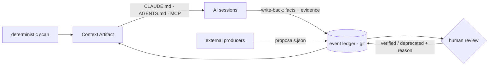

<div align="center">


### Deterministic context for non-deterministic agents

**Stop re-explaining your project to AI. `kervo init` once.**

[](https://github.com/kervo-os/kervo/actions/workflows/ci.yml)
[](https://github.com/kervo-os/kervo/releases)
[](https://goreportcard.com/report/github.com/kervo-os/kervo)
[](go.mod)
[](LICENSE)

**English** | [한국어](README.ko.md) | [日本語](README.ja.md)

[Quickstart](#quickstart) ·
[Team use](#in-a-team-repo) ·
[How it works](#how-it-works) ·
[Trust labels](#why-trust-labels) ·
[Measured](#measured-not-claimed) ·
[Capture](#capture-wire-the-hooks) ·
[Commands](#commands)

</div>

---

**Your "OK" to an agent becomes the team's signed memory.** Any agent
opening this workspace starts knowing what is true, what was decided, and
what not to trust yet — and that memory grows with every session.

<p align="center"></p>

kervo compiles your repository into a deterministic **Context Artifact** and
injects it into `CLAUDE.md` — so every AI session starts already knowing your
project. Facts are extracted deterministically; interpretations enter only as
trust-labeled proposals that can be verified, go stale, and get retired **with
their reason shown**.

This repository eats its own cooking: [`CLAUDE.md`](CLAUDE.md) here is
compiled by kervo.

## Quickstart

```bash
brew install kervo-os/tap/kervo   # macOS & Linux — prebuilt binary
# or: go install github.com/kervo-os/kervo/cmd/kervo@latest
kervo init        # scan → .kervo/artifact.md → injected into CLAUDE.md
```

Prebuilt binaries for macOS, Linux, and Windows are on the
[releases page](https://github.com/kervo-os/kervo/releases) — no Go
toolchain needed. First run on a real repository takes well under a second
(500-commit scan cap, marked `Partial` when hit). Only the block between `<!-- kervo:begin -->` and
`<!-- kervo:end -->` in `CLAUDE.md` is ever touched — everything you wrote by
hand is preserved byte-for-byte.

Using Codex or another agent that reads `AGENTS.md`? If the file exists at
the repo root, kervo injects the same marker block there too, under the same
contract. Presence is the opt-in — `touch AGENTS.md` — and kervo never
creates the file on its own.

Prefer a clean `CLAUDE.md`? `kervo compile -inject import` swaps the full
block for a single `@.kervo/artifact.md` line (Claude Code expands it at
load time). The trade-off is deliberate: the artifact file is derived and
gitignored, so fresh clones see nothing until one `kervo compile` — which
is why the full block stays the default. The choice persists per workspace
(`.kervo/inject`, committed). The `@`-line is Claude Code syntax; AGENTS.md
readers may not expand it.

**What the artifact covers:** repository summary · declared commands (Makefile
targets, npm scripts, docker-compose services, pyproject scripts, justfile
recipes) · recent changes with merge noise excluded · open TODO/FIXME tasks ·
module layout, including per-module `CLAUDE.md`/`README.md` in monorepos —
plus trust-labeled slots for goal / decisions / risks / summaries. Archival
material (quoted transcripts, vendored docs) can be excluded from the TODO
scan via `.kervoignore` — one path prefix per line.

## In a team repo

The split between committed truth and derived state is what makes the
context travel:

| State | Path | In git? |
|---|---|---|
| Event ledger — the truth | `.kervo/events/*.jsonl` | **yes** — append-only, `merge=union`: branch merges union the ledgers |
| Artifact language | `.kervo/lang` | **yes** |
| Injected context block | `CLAUDE.md` | **yes** |
| Compiled artifact | `.kervo/artifact.md` | no — derived, rebuilt by `compile` |
| Index & cache | `.kervo/index.db`, `.kervo/cache/` | no — derived |

The lifecycle:

1. **First adoption** — one person runs `kervo init` once and commits the
   result (ledger, `.kervo/lang`, injected `CLAUDE.md`, gitignore entries).
2. **A teammate clones** — the context is already live: `CLAUDE.md` carries
   the last-compiled block and the full ledger came with the clone. An AI
   session reads it with **zero commands**, and `kervo status` / `metrics`
   work immediately against the cloned ledger.
3. **Going live** — install the binary (`brew install kervo-os/tap/kervo`)
   and run `kervo compile` (not `init` again) to rescan and refresh the
   facts. `init` is idempotent too, so
   running it out of habit breaks nothing.
4. **Hooks** — commit `.claude/settings.json` and capture fires for every
   teammate automatically, as soon as `kervo` is on their PATH.

Verified on a fresh clone of this repository: `compile` replayed the
committed ledger (112 events, 4 observations), trust states and language
intact, artifact regenerated.

## How it works

The loop, end to end:



Two layers, strictly separated:

| Layer | Content | Produced by |
|---|---|---|
| **Fact skeleton** | summary, commands, changes, tasks, modules | Deterministic scan — same workspace, same bytes, golden-tested in CI. No LLM in this path, ever. |
| **Trust slots** | goal, decisions, risks, summaries | Labeled proposals with provenance — never facts, never anonymous. |

Three ways to fill the slots, degrading gracefully — a failed backend demotes
with a warning, and the fact skeleton is always produced:

| Mode | What fills the semantic slots | Requires |
|---|---|---|
| **1 — Fact-only** (default) | Nothing — deterministic facts only. Always works. | git |
| **2 — Consumer-assisted** | Your AI session stages proposals in `.kervo/proposals.json` | an agent session |
| **3 — Dedicated backend** | Any OpenAI-compatible endpoint proposes observations | a local or remote LLM |

Mode 3 is a bootstrap channel: it fills empty slots when no capturing
agent has worked in the repo yet. Once Mode 2 session capture is live,
leave the env unset — artifact-only inference reads history, not intent,
and mostly adds review noise (measured on a real repo).

Mode 3 with a fully local model (nothing leaves your machine):

```bash
export KERVO_SEMANTIC_URL=http://localhost:1234/v1   # LM Studio (or Ollama :11434/v1)
export KERVO_SEMANTIC_MODEL=openai/gpt-oss-120b
kervo compile
# Artifact: .kervo/artifact.md (Mode 3 — backend:openai/gpt-oss-120b)
```

**External producers.** Anything that generates repo knowledge — graph
builders, memory stores, wiki generators — can feed kervo by staging
entries in `.kervo/proposals.json`:

```json
[{ "slot": "summaries", "body": "AuthService depends on TokenStore", "source": "graphify" }]
```

`compile` ingests them into the ledger as `generated` with their source as
provenance, and `review` gates them like any other proposal. Two norms
keep the queue humane: **conclusions, not corpus** — what lives in files
stays in files, cited as evidence — and **backpressure**: a source with
12 proposals already awaiting judgment cannot add more until a human
judges. The shape has
no state field by design: producers cannot self-promote — other tools
generate memory; kervo decides what memory is safe to carry forward.

Artifacts render in English by default; `--lang ko` / `--lang ja` localize
them (the choice persists per workspace).

## Why trust labels

Accumulated context rots — and wrong context is worse than none. Every
non-fact enters as a labeled proposal with provenance:

```
**[generated — backend:openai/gpt-oss-120b]**
Needs confirmation — current focus appears to be terminal input/UX
hardening… Evidence: Recent Changes 05-28..06-28.
```

States move `generated → observed → verified → stale → deprecated` — by
evidence and human confirmation, not by a decay timer. When two actors
disagree, the entry is marked `⚠ conflict` instead of silently picking a
winner. Stale entries are listed with their exclusion reason instead of being
silently dropped.

The division of labor is deliberate: **agents capture, propose, and manage;
the human only judges.** And the conversation is a review surface: when the
human affirms a fact in-session, the agent relays that judgment with the
capture, quoting their words — the queue holds only what no human has seen. `kervo review` is that judging surface — a triage
queue over everything awaiting a decision, one item at a time.

Every artifact ends with a **write-back protocol** that closes the loop on
exploration: it instructs any AI consumer to capture the durable facts it
had to discover the hard way — how to run things, component roles,
in-conversation decisions — as proposals. Judge them once with
`kervo review`, and every later session — any agent, any teammate — gets
the answer for zero tool calls. Proposals carry **evidence** — the command
the agent ran, the doc it read — so verification labor sits with the agent
and the human signature takes one keystroke. Duplicate bodies are dropped
automatically, so the queue stays clean.

## Measured, not claimed

Does any of this actually protect an agent from poisoned context? We
pre-registered the hypothesis and ran a blind experiment: same repository,
three context arms — **A** (kervo artifact), **B** (same content, trust labels
stripped), **C** (unmanaged notes) — with seeded false "decisions", fresh
consumer sessions, and judges blind to arm and hypothesis.

Confirmatory run (pre-registered, no repo access, sonnet + haiku consumers,
n = 24):

| | **A — kervo** | B — labels stripped | C — unmanaged |
|---|---|---|---|
| Composite S1+S2+S3 | **91.7%** | 91.7% | 62.5% |

- **A−C = +29.2pp**, meeting the pre-registered ≥20pp bar. Every actual
  poisoning infection in the whole program (3/3) happened in arm C with the
  weaker consumer model.
- Across all 54 responses in the program, arm A never lost a point to a
  poisoned claim. In the mixed condition (repo access allowed), unlabeled arms
  failed by *contagion*: one discovered lie caused true facts to be rejected
  alongside it — labels kept `verified` trusted while quarantining only the
  `⚠ conflict` entry.
- Takeaway: an agent can refute lies the code disproves; **labels protect the
  truth that lives outside the code** — decisions, constraints, context. The
  weaker the consumer, the larger the protection.

Full protocol, pre-registration, arm artifacts, and all 54 raw responses:
[kervo-os/experiments/h4](https://github.com/kervo-os/experiments/tree/main/h4). Grades are agent-judged under
a pre-registered rubric by structurally blinded judges; a human-grading
replication kit is included but has not been run — the limitation is
stated, not hidden.

And on a real production monorepo (2026-07-06, from its own ledger):

| What was measured | Result |
|---|---|
| Write-back pilot: capture → ledger → compile → fresh consumer | onboarding answers **5.5/10 → 9.5/10**, cost unchanged (1 tool call) |
| Trust labels reaching consumers | the consuming agent flagged its own answer as `[generated]`, unprompted |
| Mode 3 backend proposals, graded against ground truth | goal C+ / risk D → repositioned as a bootstrap channel (see above) |

The pre-registered full re-run happens at a volume gate (10 sessions +
10 judged write-backs), not on a calendar.

## Capture: wire the hooks

Live capture feeds the ledger and the built-in measurement counters. For
Claude Code, add to your project's `.claude/settings.json` (hooks run in the
project directory, so `kervo` just needs to be on PATH):

```json
{
  "hooks": {
    "UserPromptSubmit": [
      { "hooks": [{ "type": "command", "command": "kervo hook || true", "timeout": 10 }] }
    ],
    "SessionStart": [
      { "hooks": [{ "type": "command", "command": "kervo hook || true", "timeout": 10 }] }
    ],
    "PostToolUse": [
      { "matcher": "Edit|Write",
        "hooks": [{ "type": "command", "command": "kervo hook || true", "timeout": 10 }] }
    ]
  }
}
```

Keep the digest itself fresh without thinking about it — a git post-commit
hook:

```bash
printf '#!/bin/sh\nkervo compile >/dev/null 2>&1 || true\n' > .git/hooks/post-commit
chmod +x .git/hooks/post-commit
```

The hook is a millisecond-budget local append — no LLM, no network, and it
never breaks your session (garbage in, exit 0 out). The committed ledger
stores **names, paths, and sizes only**: prompt and file contents never leave
your machine or enter git history.

```bash
kervo capture -type decision -body "JWT over sessions"   # record by hand
kervo review                                             # triage queue: judge proposals one by one
kervo trust -id 01KWP -to verified -reason "team agreed" # judge by ID (scripts)
kervo status                                             # one-screen trust view
kervo metrics                                            # prompt sizes: with vs without artifact
kervo import claude                                      # back-fill from past Claude Code sessions
```

Prefer judging from the chat? Register the MCP server and the conversation
becomes the review surface — *"show me the review queue"* → *"verify #2,
the evidence checks out"*:

```json
{ "mcpServers": { "kervo": { "command": "kervo", "args": ["mcp"] } } }
```

Four tools: `read_context` (facts out), `kervo_capture` (write-back in),
`review_queue` / `review_judge` (relaying the human's stated judgment,
never the agent's own). For batch triage, `kervo review -web` serves a
one-shot local page — it lives only as long as the command, binds
127.0.0.1, and keeps every design guarantee (no daemon, no account).

### The fleet: `kervo dash`

Every `kervo compile` registers its workspace **path** (path only,
machine-local, never committed) in `~/.kervo/workspaces.json`. `kervo dash`
opens a one-shot dashboard over all of them — pending judgments, 28-day
activity, trust-state mix, the project overview (declared commands, recent
changes, modules), coupling proven by commit history, and which adapters
are actually connected — with keyboard-first inline triage (`1`–`9` open a
repo, `j`/`k` move, `v`/`s`/`d` judge, `?` for keys) that writes each
judgment back to that repo's own ledger. Below the queue, the knowledge
view renders every verified and observed entry in full — claim first,
evidence attached — and retired entries keep their reasons.

<p align="center"></p>

<p align="center"></p> Truth stays per-repo in
git; the dashboard is a lens, not a store, and it dies with the command.
The chrome speaks your language — `$LANG`, `-lang en|ko|ja`, or the in-page
switcher, whose choice sticks for the next launch. Observation bodies stay
in whatever language their proposer wrote.

## Commands

| Command | Does |
|---|---|
| `kervo init` | First-time: scan → artifact → inject `CLAUDE.md` (idempotent) |
| `kervo compile [-lang en\|ko\|ja] [-inject block\|import]` | Incremental rescan + recompile; Mode 3 → 2 → 1 fallback |
| `kervo capture -type <t> -body <text>` | Record an observation into the ledger |
| `kervo trust -id <prefix> -to verified\|stale\|deprecated -reason <r>` | Judge an observation by ID (the scriptable primitive) |
| `kervo review [-web]` | Triage queue — judge proposals and ⚠ conflicts one by one; `-web` serves a one-shot local page |
| `kervo dash` | Fleet dashboard — every registered workspace on one page, inline triage |
| `kervo status` | One-screen ledger + trust view |
| `kervo metrics` | Prompt sizes with vs without the artifact (built-in A/B counters) |
| `kervo import claude` | Back-fill the ledger from Claude Code transcripts (sizes only) |
| `kervo hook` | Consumer hook entry point (stdin JSON, millisecond budget) |
| `kervo mcp` | stdio MCP server — context out, write-back in, judging from the chat |
| `kervo version` | Print version |

## Design guarantees

- **Deterministic skeleton** — same workspace, same language, same bytes;
  pinned by golden files in CI. No LLM in the fact path, ever.
- **Events are truth** — an append-only JSONL ledger, committed to git
  (`merge=union`); the artifact and index are derived and rebuildable.
  Clone the repo, and its compiled memory moves with it.
- **Boundaries as checks** — the pure core cannot import adapters
  (`make arch-check`); data-derived text cannot impersonate structural
  markers; providers cannot self-promote past `generated`.
- **No server, no daemon, no database, no account** — all state lives in
  `.kervo/` and `CLAUDE.md`.

## Status

v0, moving fast. Cold-start validation passed with semantic slots enabled;
the capture → verify → stale loop is live in this repository. PRD / RFCs /
experiment protocols will be published as they stabilize.

---

kervo is not a coding tool. It is a memory layer for any team that lives on
git — developers are simply the first market, because they already store
their work as commits.

Licensed under [Apache-2.0](LICENSE).
