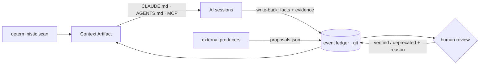

<div align="center">


### Deterministic context for non-deterministic agents

**Stop re-explaining your project to AI. `kervo init` once.**

[](https://github.com/kervo-os/kervo/actions/workflows/ci.yml)
[](https://github.com/kervo-os/kervo/releases)
[](go.mod)
[](https://goreportcard.com/report/github.com/kervo-os/kervo)
[](LICENSE)

**English** | [한국어](README.ko.md) | [日本語](README.ja.md)

[Install](#install) ·
[Quick start](#quick-start) ·
[Features](#features) ·
[Dashboard](#the-dashboard) ·
[Team use](#in-a-team-repo) ·
[Measured](#measured-not-claimed) ·
[Commands](#commands) ·
[Contributing](#contributing)

</div>

---

**Your "OK" to an agent becomes the team's signed memory.** Any agent
opening this workspace starts knowing what is true, what was decided, and
what not to trust yet — and that memory grows with every session.

<p align="center"></p>

kervo compiles your repository into a deterministic **Context Artifact**
and injects it into `CLAUDE.md` / `AGENTS.md` — so every AI session starts
already knowing your project. Facts are extracted deterministically;
interpretations enter only as trust-labeled proposals that can be
verified, go stale, and get retired **with their reason shown**. This
repository eats its own cooking: [`CLAUDE.md`](CLAUDE.md) here is compiled
by kervo.

## Install

```bash
brew install kervo-os/tap/kervo   # macOS & Linux
npm install -g @kervo-os/kervo    # any platform with Node 18+
# or: go install github.com/kervo-os/kervo/cmd/kervo@latest
```

Prebuilt binaries for macOS, Linux, and Windows are on the
[releases page](https://github.com/kervo-os/kervo/releases) — no Go
toolchain needed.

## Quick start

An interactive `kervo init` asks two questions and scans in well under a
second (500-commit cap, marked partial when hit):


The artifact covers: repository summary · declared commands (Makefile,
npm scripts, docker-compose, pyproject, justfile) · recent changes with
merge noise excluded · open TODO/FIXME tasks · module layout, including
per-module docs in monorepos — plus trust-labeled slots for goal /
decisions / risks / summaries.

Only the block between `<!-- kervo:begin -->` and `<!-- kervo:end -->` is
ever touched — everything you wrote by hand is preserved byte-for-byte,
and re-running `init` is idempotent.

## The loop



Agents discover and propose. Humans judge once. Verified context returns
to every future session — any agent, any teammate — for zero tool calls.
Two layers, strictly separated:

| Layer | Content | Produced by |
|---|---|---|
| **Fact skeleton** | summary, commands, changes, tasks, modules | Deterministic scan — same workspace, same bytes, golden-tested in CI. No LLM in this path, ever. |
| **Trust slots** | goal, decisions, risks, summaries | Labeled proposals with provenance — never facts, never anonymous. |

## Features

**Trust lifecycle.** Accumulated context rots — and wrong context is worse
than none. Every non-fact enters as a labeled proposal with provenance:

```text
**[generated — backend:openai/gpt-oss-120b]**
Needs confirmation — current focus appears to be terminal input/UX
hardening… Evidence: Recent Changes 05-28..06-28.
```

States move `generated → observed → verified → stale → deprecated` — by
evidence and human confirmation, not by a decay timer. Disagreement is
marked `⚠ conflict` instead of silently picking a winner; retired entries
keep their exclusion reason. Agents capture, propose, and manage; **the
human only judges** — and agents never sign their own claims.

**The Brief.** Every artifact opens with deterministic orientation —
where recent commits concentrate, one run line, open task edges, unpushed
count. Counting, never intent-reading; empty signals render nothing.

**The write-back protocol.** The artifact tells any AI consumer to
capture the durable facts it had to discover the hard way — claim-first
markdown with **evidence** (the command it ran, the doc it read) — so
verification labor sits with the agent and the human signature takes one
keystroke. Duplicates drop automatically; a source with 12 unjudged
proposals hits backpressure until a human catches up.

**The conversation is the review.** When you affirm a fact in-session,
the agent relays that judgment with the capture, quoting your words. The
queue holds only what no human has seen; evidence that contradicts a
verified entry comes back as a question, never a silent re-proposal.

**Judge anywhere.** In the chat via MCP, in the terminal via
`kervo review`, or across every repo at once in the
[dashboard](#the-dashboard).

<details>
<summary><b>Consumers — Claude Code, Codex, and anything that speaks MCP</b></summary>
<br>

`kervo init -consumers claude|codex|both|auto` picks the injection
targets; the choice persists per workspace (`.kervo/consumers`,
committed). An existing `AGENTS.md` is always honored — presence is the
opt-in, and kervo never creates the file on its own.

Prefer a clean `CLAUDE.md`? `kervo compile -inject import` swaps the full
block for a single `@.kervo/artifact.md` line. The trade-off is
deliberate: the artifact file is derived and gitignored, so fresh clones
see nothing until one `kervo compile` — which is why the full block stays
the default. (`@`-line is Claude Code syntax; AGENTS.md readers may not
expand it.)

Register the MCP server and the conversation becomes the review surface —
*"show me the review queue"* → *"verify #2, the evidence checks out"*:

```json
{ "mcpServers": { "kervo": { "command": "kervo", "args": ["mcp"] } } }
```

Four tools: `read_context` (facts out), `kervo_capture` (write-back in),
`review_queue` / `review_judge` (relaying the human's stated judgment,
never the agent's own).
</details>

<details>
<summary><b>Hooks — automatic capture, wired by the wizard</b></summary>
<br>

The init wizard writes this file for you (`-hooks yes` in scripts); to
wire it by hand, add to your project's `.claude/settings.json`:

```json
{
  "hooks": {
    "UserPromptSubmit": [
      { "hooks": [{ "type": "command", "command": "kervo hook || true", "timeout": 10 }] }
    ],
    "SessionStart": [
      { "hooks": [{ "type": "command", "command": "kervo hook || true", "timeout": 10 }] }
    ],
    "PostToolUse": [
      { "matcher": "Edit|Write",
        "hooks": [{ "type": "command", "command": "kervo hook || true", "timeout": 10 }] }
    ]
  }
}
```

The hook is a millisecond-budget local append — no LLM, no network, and
it never breaks a session (garbage in, exit 0 out). The committed ledger
stores **names, workspace-relative paths, and sizes only**: prompt and
file contents never leave your machine or enter git history.

Freshness is not opt-in: every `init`/`compile` wires a `pre-commit`
hook — each commit recompiles and **carries its own fresh artifact**,
so the tree stays clean — and a `post-merge` hook, so incoming pulls
refresh it too. Git hooks are machine-local: a teammate's first
`kervo compile` wires their machine. A hook you wrote yourself is never
rewritten (replacing ours with your own is the opt-out).
</details>

<details>
<summary><b>External producers — anything can feed the ledger</b></summary>
<br>

Graph builders, memory stores, wiki generators: stage entries in
`.kervo/proposals.json` and `compile` ingests them as `generated` with
their source as provenance —

```json
[{ "slot": "summaries", "body": "AuthService depends on TokenStore", "source": "graphify" }]
```

The shape has no state field by design: producers cannot self-promote.
Two norms keep the queue humane — **conclusions, not corpus** (what lives
in files stays in files, cited as evidence) and **backpressure**. Other
tools generate memory; kervo decides what memory is safe to carry
forward.
</details>

<details>
<summary><b>Semantic slots — three modes, graceful degradation</b></summary>
<br>

| Mode | What fills goal / decisions / risks / summaries | Requires |
|---|---|---|
| **1 — Fact-only** (default) | Nothing — deterministic facts only. Always works. | git |
| **2 — Consumer-assisted** | Your AI session stages proposals | an agent session |
| **3 — Dedicated backend** | Any OpenAI-compatible endpoint proposes | a local or remote LLM |

A failed backend demotes with a warning; the fact skeleton is always
produced. Mode 3 is a bootstrap channel for repos no capturing agent has
worked in yet — once Mode 2 capture is live, leave the env unset
(measured on a real repo: artifact-only inference reads history, not
intent). Fully local, nothing leaves your machine:

```bash
export KERVO_SEMANTIC_URL=http://localhost:1234/v1   # LM Studio (or Ollama :11434/v1)
export KERVO_SEMANTIC_MODEL=openai/gpt-oss-120b
kervo compile
```

Artifacts render in English by default; `-lang ko` / `-lang ja` localize
them, per workspace. Archival material can be excluded from the TODO scan
via `.kervoignore` — one path prefix per line.
</details>

## The dashboard

Every `kervo compile` registers its workspace **path** (path only,
machine-local, never committed) in `~/.kervo/workspaces.json`;
`kervo dash` opens a one-shot 127.0.0.1 dashboard over all of them —
pending judgments, 28-day activity, trust-state mix, the project overview,
coupling proven by commit history, and which adapters are actually
connected — with keyboard-first triage (`1`–`9` open a repo, `j`/`k`
move, `v`/`s`/`d` judge, `?` for keys) that writes each judgment to that
repo's own ledger.

<p align="center"></p>

Below the queue, the knowledge view renders every verified and observed
entry in full — claim first, evidence attached — and retired entries keep
their reasons. The chrome speaks your language (`$LANG`, `-lang`, or the
in-page switcher). Truth stays per-repo in git; the dashboard is a lens,
not a store, and it dies with the command.

<p align="center"></p>

## In a team repo

The split between committed truth and derived state is what makes the
context travel:

| State | Path | In git? |
|---|---|---|
| Event ledger — the truth | `.kervo/events/*.jsonl` | **yes** — append-only, `merge=union`: branch merges union the ledgers |
| Language · inject mode · consumers | `.kervo/lang` … | **yes** — team choices |
| Injected context block | `CLAUDE.md` / `AGENTS.md` | **yes** |
| Compiled artifact, cache | `.kervo/artifact.md` … | no — derived, rebuilt by `compile` |

1. **First adoption** — one person runs `kervo init` once and commits the
   result.
2. **A teammate clones** — the context is already live: an AI session
   reads it with **zero commands**, and `kervo status` / `dash` work
   immediately against the cloned ledger.
3. **Going live** — `brew install kervo-os/tap/kervo`, then
   `kervo compile` to rescan (`init` is idempotent, so habit breaks
   nothing).
4. **Hooks** — the committed `.claude/settings.json` fires capture for
   every teammate automatically, as soon as `kervo` is on their PATH.

Verified on a fresh clone of this repository: `compile` replayed the
committed ledger, trust states and language intact.

## Measured, not claimed

Does any of this actually protect an agent from poisoned context? We
pre-registered the hypothesis and ran a blind experiment: same repository,
three context arms — **A** (kervo artifact), **B** (same content, trust
labels stripped), **C** (unmanaged notes) — with seeded false "decisions",
fresh consumer sessions, and judges blind to arm and hypothesis.

Confirmatory run (pre-registered, no repo access, sonnet + haiku
consumers, n = 24):

| | **A — kervo** | B — labels stripped | C — unmanaged |
|---|---|---|---|
| Composite S1+S2+S3 | **91.7%** | 91.7% | 62.5% |

- **A−C = +29.2pp**, meeting the pre-registered ≥20pp bar. Every actual
  poisoning infection in the whole program (3/3) happened in arm C with
  the weaker consumer model.
- Across all 54 responses, arm A never lost a point to a poisoned claim.
  Unlabeled arms failed by *contagion*: one discovered lie caused true
  facts to be rejected alongside it.
- An agent can refute lies the code disproves; **labels protect the truth
  that lives outside the code** — decisions, constraints, context. The
  weaker the consumer, the larger the protection.

And on a real production monorepo (from its own ledger):

| What was measured | Result |
|---|---|
| Write-back pilot: capture → ledger → compile → fresh consumer | onboarding answers **5.5/10 → 9.5/10**, cost unchanged (1 tool call) |
| Trust labels reaching consumers | the consuming agent flagged its own answer as `[generated]`, unprompted |
| Mode 3 backend proposals, graded against ground truth | goal C+ / risk D → repositioned as a bootstrap channel |

Full protocols, pre-registrations, and all raw responses:
[kervo-os/experiments](https://github.com/kervo-os/experiments). Grades
are agent-judged under a pre-registered rubric by structurally blinded
judges; a human-grading replication kit is included but has not been run
— the limitation is stated, not hidden.

## Commands

| Command | Does |
|---|---|
| `kervo init` | First-time wizard: scan → artifact → inject (idempotent) |
| `kervo compile [-lang en\|ko\|ja] [-inject block\|import]` | Incremental rescan + recompile; Mode 3 → 2 → 1 fallback |
| `kervo capture -type <t> -body <md> -evidence <e>` | Record an observation (dedup + backpressure guarded) |
| `kervo trust -id <prefix> -to verified\|stale\|deprecated -reason <r>` | Judge by ID (the scriptable primitive) |
| `kervo review` | Triage queue in the terminal — judge one by one |
| `kervo dash` | Fleet dashboard — every registered workspace on one page, inline triage |
| `kervo status` | One-screen ledger + trust view |
| `kervo metrics` | Prompt sizes with vs without the artifact (built-in A/B counters) |
| `kervo import claude` | Back-fill the ledger from Claude Code transcripts (sizes only) |
| `kervo hook` | Consumer hook entry point (stdin JSON, millisecond budget) |
| `kervo mcp` | stdio MCP server — context out, write-back in, judging from the chat |
| `kervo version` | Print version |

## Design guarantees

- **Deterministic skeleton** — same workspace, same language, same bytes;
  pinned by golden files in CI. No LLM in the fact path, ever.
- **Events are truth** — an append-only JSONL ledger, committed to git
  (`merge=union`); everything else is derived and rebuildable. Clone the
  repo, and its memory moves with it.
- **Boundaries as checks** — the pure core cannot import adapters
  (`make arch-check`); data-derived text cannot impersonate structural
  markers; providers cannot self-promote past `generated`; agents cannot
  sign their own claims.
- **No server, no daemon, no database, no account** — all state lives in
  `.kervo/` and the consumer files. Zero dependencies: `go.mod` is
  stdlib-only.

## Status & roadmap

v0.19.x, running on production repositories — releases are CI-gated and
cut only for a reason ([CHANGELOG.md](CHANGELOG.md) has every one).
Evidence lives in [kervo-os/experiments](https://github.com/kervo-os/experiments).
Next gate: the pre-registered flywheel re-run at 10 sessions + 10 judged
write-backs — volume, not calendar.

## Contributing

```bash
make build   # go 1.23+; the only build step there is
go test -race ./...
make arch-check   # the core must not import adapters
```

Issues and PRs are welcome. Two things reviewers will hold you to:
**zero dependencies** (`go.mod` is stdlib-only; a new dependency needs an
exceptional reason) and **determinism** (the skeleton is pinned by golden
files; i18n tables are pinned complete; CI runs the race detector).
Design decisions live in this repo's own ledger — open `kervo dash` on
your clone and read the knowledge view.

---

kervo is not a coding tool. It is a memory layer for any team that lives
on git — developers are simply the first market, because they already
store their work as commits.

Licensed under [Apache-2.0](LICENSE).
